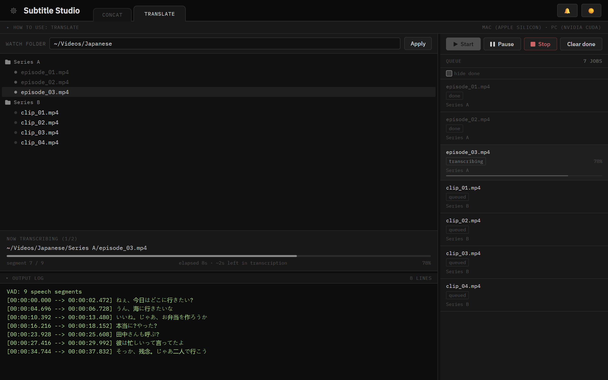
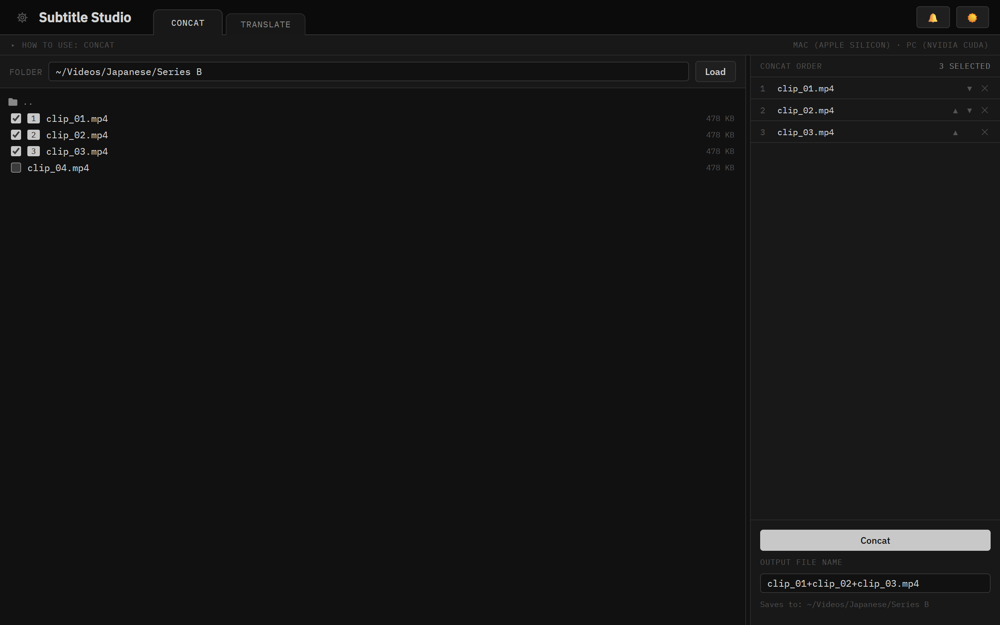
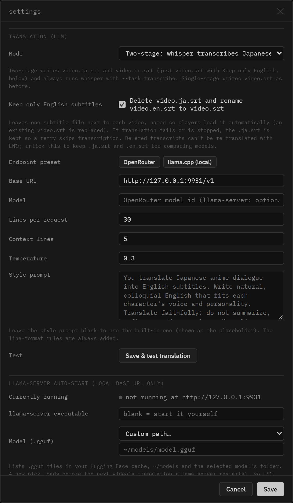
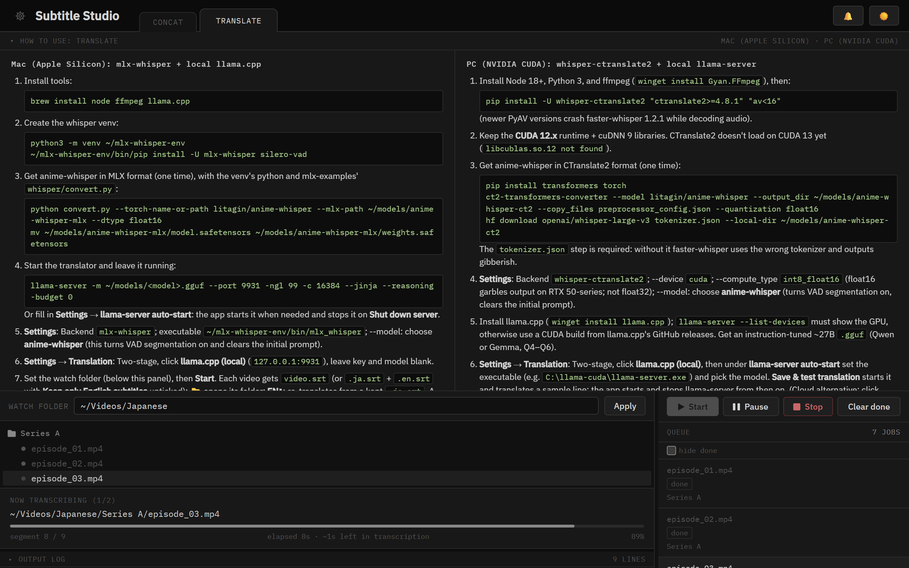
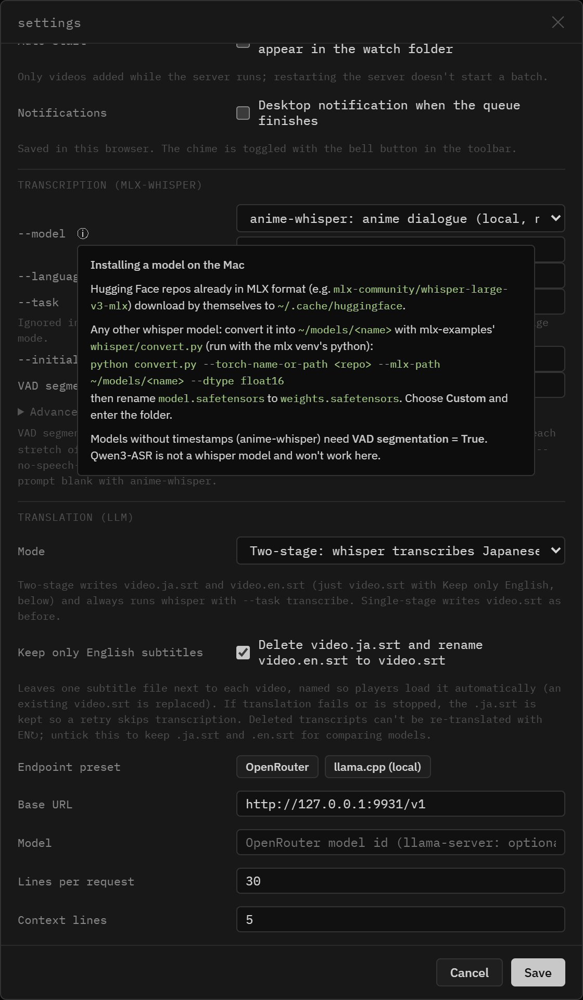

# Subtitle Studio

A local web UI for batch-subtitling Japanese anime in English. Drop episodes
into a watch folder; whisper transcribes the Japanese (with anime-tuned models
such as anime-whisper), and an LLM translates the subtitles with surrounding
lines as context. Transcription runs on either `whisper-ctranslate2` (NVIDIA
CUDA / CPU) or `mlx-whisper` (Apple Silicon GPU via MLX), so pick whichever
backend matches the machine. It also joins video files (the Concat tab). The
repository and folder are named `anime-subtitle-studio`.



## Prerequisites

- Node.js 18+
- `ffprobe` on PATH (comes with ffmpeg — used for duration estimation)
- One whisper backend, depending on your machine:
  - **NVIDIA GPU / CPU**: `whisper-ctranslate2` (`pip install whisper-ctranslate2 "av<16"`). See [`WINDOWS_CUDA_SETUP.md`](docs/WINDOWS_CUDA_SETUP.md) for a full walkthrough.
  - **Apple Silicon (M-series) GPU**: `mlx-whisper` (`pip install mlx-whisper`) — CTranslate2 has no Metal/MPS support, so this is the backend that actually uses the GPU on a Mac. See [`APPLESILICON_SETUP.md`](docs/APPLESILICON_SETUP.md) for a full walkthrough.

## Setup

For a complete machine setup (Python environment, GPU libraries, models,
translation), follow the guide for your machine:

- **Windows PC (NVIDIA CUDA):** [`WINDOWS_CUDA_SETUP.md`](docs/WINDOWS_CUDA_SETUP.md)
- **Mac (Apple Silicon):** [`APPLESILICON_SETUP.md`](docs/APPLESILICON_SETUP.md)

Then, or for a quick start:

```bash
# 1. Install dependencies
npm install

# 2. Start the server
npm start

# 3. Open in browser
# http://localhost:3939
```

For development with auto-restart on file changes:
```bash
npm run dev
```

## Usage

1. **Watch folder** — set the root folder in the top bar or via Settings. All `.mp4` files found recursively are added to the queue automatically.
2. **Start** — begins processing the queue sequentially. Each file runs the configured backend (`whisper-ctranslate2` or `mlx-whisper`) with the configured parameters.
3. **Pause / Resume** — pausing stops the queue after the current segment finishes (the active job keeps running until it completes naturally; use **Stop** in the queue pane to end it now).
4. **Settings** (gear icon → Settings…) — pick the backend, edit the watch folder, and edit that backend's whisper parameters. Changes are saved to `config.json` and applied immediately.
5. **Output** — subtitles are written to the same directory as each source `.mp4`: `video.srt` in two-stage mode with **Keep only English subtitles** on (the default: the transcript is deleted and the English file renamed so players load it), `video.ja.srt` + `video.en.srt` with it off, or `video.srt` in single-stage mode. The page plays a chime when the queue finishes or a concat completes.
6. **Re-translate** — the **EN↻** button on a finished item re-runs only the translation step.
7. **Queue tools** — the top of the queue pane has **Start**, **Pause**/**Resume**, **Stop** (stops the current job) and **Clear done**; drag its left edge to widen it; click a queue item to see just its log (errors show under the name); 👁 previews its subtitles (Japanese and English side by side); 📂 opens its folder with the subtitle file selected (also in the preview, and **Show file** on the Concat tab after a join); **retry errors** requeues every failed video; **hide done** declutters the list. The tab title shows progress, the 🔔 button mutes the chime, and Settings can send a desktop notification and auto-start new videos.
8. **Gear menu** — the gear icon (top left) has **Settings…**, **Reboot server** and **Shut down server**. Reboot and Shut down both stop a running job (a finished `.ja.srt` is kept) and release the port; reboot brings the page back when the server is up. Closing the terminal window or pressing Ctrl+C twice also shuts down cleanly (one Ctrl+C finishes the current job first).

## Concat

The **Concat** tab joins several videos into one before translating (e.g. a
release split into parts). Browse to a folder, tick the files in playback
order, reorder them on the right if needed, name the output, and press
**Concat**. It's an ffmpeg stream copy (no re-encode, no GPU), so all parts must
share codec, resolution and frame rate. The output is saved next to the first
file, and if that's inside the watch folder it's queued for translation
automatically. **Cancel** deletes the partial file.



## Two-stage translation (recommended)

Whisper's built-in `translate` task is weak for Japanese (large-v3 is worse than
large-v2 at it, and large-v3-turbo can't translate at all). With **Settings →
Translation → Two-stage**, whisper only transcribes Japanese (`video.ja.srt`), and
an LLM translates it with surrounding context into `video.en.srt`.



Any OpenAI-compatible endpoint works:

- **OpenRouter**: base URL `https://openrouter.ai/api/v1`, an API key, and a model id.
- **llama.cpp**: run `llama-server -m model.gguf --port 9931 -ngl 99 --jinja` and use `http://127.0.0.1:9931/v1` (the "llama.cpp (local)" preset). No key is needed. 9931 is llama.cpp's upcoming default port; passing `--port 9931` explicitly works on both older and newer builds.
  Or let the app run it: fill in **Settings → llama-server auto-start** (executable, `.gguf` model, extra args, model load wait). When a video reaches translation and nothing answers at the local base URL, the app starts llama-server and waits up to the load wait (default 15 s) for the model. **Shut down server** stops it again (also one you started yourself on that port); **Reboot** leaves it loaded.

Thinking models are fine: `<think>…</think>` blocks are stripped from replies, but a non-thinking model (or `--reasoning-budget 0` on llama-server) is much faster.

### Recommended setup per machine

Each machine runs the whole pipeline by itself, using its own `config.json`:

| | Windows PC (NVIDIA) | Mac (Apple Silicon) |
|---|---|---|
| Backend | `ctranslate2` | `mlx` |
| Transcription | anime-whisper (CTranslate2) with VAD segmentation, `--compute_type int8_float16`, see [`WINDOWS_CUDA_SETUP.md`](docs/WINDOWS_CUDA_SETUP.md) | anime-whisper (MLX) with VAD segmentation, see [`APPLESILICON_SETUP.md`](docs/APPLESILICON_SETUP.md) |
| Translation | local `llama-server` on port 9931 (the app can start it) or OpenRouter | local `llama-server` on port 9931 |
| Setup guide | [`WINDOWS_CUDA_SETUP.md`](docs/WINDOWS_CUDA_SETUP.md) | [`APPLESILICON_SETUP.md`](docs/APPLESILICON_SETUP.md) |

The **How to use** panel at the top of the Translate and Concat screens (under the tabs) has
the same steps for each machine.



### anime-whisper and VAD segmentation

[anime-whisper](https://huggingface.co/litagin/anime-whisper) (MIT) is
fine-tuned on anime and visual-novel dialogue and transcribes non-speech
vocalizations that other models skip or hallucinate on. It was trained on short
single lines, so **it never outputs timestamps**. Run through whisper's normal
long-form mode, you get one 30-second subtitle per window and lines dropped at
window boundaries.

The **VAD segmentation** setting (both backends) fixes this:
`scripts/vad_transcribe.py` runs Silero VAD, transcribes each stretch of speech
on its own, and uses the VAD times as cue timings (long cues are split at
Japanese punctuation). It runs with mlx-whisper on the Mac (`--engine mlx`, on
by default) and faster-whisper on the PC (`--engine ct2`, off by default; the
anime-whisper preset turns it on). It also cuts hallucinations for regular
whisper models. Never set an initial prompt with anime-whisper; its author warns
that prompts make it hallucinate. On the PC, anime-whisper *requires* VAD
segmentation: the plain whisper-ctranslate2 CLI crashes building word
timestamps for it.

### Choosing and installing models

**Settings → --model** has a dropdown per backend (hover ⓘ for install steps):



| Preset | Mac (`mlx`) | PC (`ctranslate2`) |
|---|---|---|
| anime-whisper: anime dialogue | `~/models/anime-whisper-mlx` | `~/models/anime-whisper-ct2` |
| whisper-ja-1.5B: Japanese large-v3 fine-tune | `~/models/whisper-ja-1.5B-mlx` | `~/models/whisper-ja-1.5B-ct2` |
| whisper-ja-anime-v0.3: anime, turbo fine-tune (experimental) | — | `~/models/whisper-ja-anime-v0.3-ct2` |
| kotoba-whisper v2.0 (= v2.1/v2.2 here): Japanese, fast | `~/models/kotoba-whisper-v2.0-mlx` | `~/models/kotoba-whisper-v2.0-faster` |
| whisper large-v3 / large-v2 | `mlx-community/whisper-large-v3-mlx` / `-v2-mlx` (auto-download) | `large-v3` / `large-v2` (auto-download) |
| Custom… | any MLX folder or HF repo id | any CTranslate2 folder |

These are whisper-compatible Japanese models. (Qwen3-ASR is a different
architecture and can't run here.) `~` expands to your home
folder on both OSes. Local models live in `~/models/<name>`:

- **Mac:** convert with mlx-examples' `whisper/convert.py`, then rename
  `model.safetensors` to `weights.safetensors`. See [`APPLESILICON_SETUP.md`](docs/APPLESILICON_SETUP.md).
- **PC, anime-whisper** (step 5 of [`WINDOWS_CUDA_SETUP.md`](docs/WINDOWS_CUDA_SETUP.md)):
  ```bash
  pip install transformers torch
  ct2-transformers-converter --model litagin/anime-whisper --output_dir ~/models/anime-whisper-ct2 --copy_files preprocessor_config.json --quantization float16
  hf download openai/whisper-large-v3 tokenizer.json --local-dir ~/models/anime-whisper-ct2
  ```
  The folder **must contain `tokenizer.json`**. anime-whisper's repo doesn't ship
  one, and without it faster-whisper falls back to a tokenizer with a different
  vocabulary, so every special token is off by one and the output is gibberish.
  Third-party anime-whisper CT2 uploads may have the same problem.
- **whisper-ja-1.5B** ([efwkjn/whisper-ja-1.5B](https://huggingface.co/efwkjn/whisper-ja-1.5B)):
  a full large-v3 fine-tune (32 decoder layers vs anime-whisper's 2), so about
  3 GB and slower. The author's benchmarks on visual-novel test sets put it
  roughly level with anime-whisper. Unlike anime-whisper it does output
  timestamps, but cues that cross a 30-second window boundary can start early,
  so its preset also turns VAD segmentation on. Its repo ships `tokenizer.json`,
  so the CT2 conversion needs no extra step. On the PC, skip the conversion:
  TransWithAI publishes it already converted:
  ```bash
  hf download TransWithAI/whisper-ja-1.5B-ct2 --local-dir ~/models/whisper-ja-1.5B-ct2
  ```
  On the Mac, convert with `--torch-name-or-path efwkjn/whisper-ja-1.5B --mlx-path ~/models/whisper-ja-1.5B-mlx`.
  Note: the model card doesn't state a license.
- **PC, whisper-ja-anime-v0.3** ([efwkjn/whisper-ja-anime-v0.3](https://huggingface.co/efwkjn/whisper-ja-anime-v0.3), experimental):
  a large-v3-turbo fine-tune with its own smaller Japanese vocabulary. It runs
  in faster-whisper as is (VAD segmentation on):
  `ct2-transformers-converter --model efwkjn/whisper-ja-anime-v0.3 --output_dir ~/models/whisper-ja-anime-v0.3-ct2 --copy_files tokenizer.json preprocessor_config.json --quantization float16`
- **PC, kotoba-whisper:** `hf download kotoba-tech/kotoba-whisper-v2.0-faster --local-dir ~/models/kotoba-whisper-v2.0-faster`
  (the official build already includes `tokenizer.json`). kotoba **v2.1/v2.2**
  are the same weights plus punctuation/diarization steps that only run in
  Hugging Face's pipeline, so they transcribe identically here.

Measured results (RTX 5090, VAD segmentation) are in
[`WINDOWS_CUDA_SETUP.md` → Which model?](docs/WINDOWS_CUDA_SETUP.md#which-model).

whisper-ctranslate2's `--model` only accepts stock names, so the app passes any
other value as `--model_directory`.

### PC Python packages

Full walkthrough, including the CUDA 12 libraries: [`WINDOWS_CUDA_SETUP.md`](docs/WINDOWS_CUDA_SETUP.md).

```bash
pip install -U whisper-ctranslate2 "ctranslate2>=4.8.1" "av<16"
```

**On an RTX 50-series (Blackwell) GPU, use `--compute_type int8_float16`, not
`float16`.** On these cards float16 can make CTranslate2
decode some 30-second windows into garbage, and the corruption carries over to
the following windows: an RTX 5070 produced 0 subtitles on float16 and 62 on
int8_float16.
CTranslate2 4.6.2 turned INT8 off on these cards, and 4.8.1 turned it back on,
hence the version pin. It's the default for new configs. On older NVIDIA cards
(RTX 20/30/40) `float16` is fine and somewhat faster. Never use `float32` on a GPU.

faster-whisper 1.2.1 crashes decoding audio with PyAV 19 (`open() got an
unexpected keyword argument 'metadata_errors'`); PyAV 15.1 works. The VAD
script decodes with the ffmpeg CLI instead, so it isn't affected.

On the PC, keep the CUDA 12.x runtime libraries: CTranslate2 is built against
CUDA 12 (up to 12.8) and fails to load (`libcublas.so.12 not found`) on CUDA 13.

The **EN↻** button on a finished item re-translates from the existing `.ja.srt`
without re-running whisper, so you can try other models or prompts cheaply.
It needs **Keep only English subtitles** turned off (it's on by default and
deletes the `.ja.srt` once the English subtitles are written, then renames
`video.en.srt` to `video.srt`).

## Backends

`config.json`'s `"backend"` field selects which whisper CLI is spawned. The
two backends have different parameter sets since their underlying CLIs
differ — the UI's Settings panel shows the right fields for whichever
backend is selected.

### `whisper-ctranslate2` (`backend: "ctranslate2"`)

```
--model large-v3
--device cuda
--compute_type int8_float16
--output_format srt
--language ja
--task translate
--vad_filter True
--vad_threshold 0.28
--vad_min_speech_duration_ms 100
--vad_min_silence_duration_ms 300
--suppress_blank True
--beam_size 4
--temperature 0.0
--no_speech_threshold 0.4
--word_timestamps True
--initial_prompt "Optional prompt to guide transcription style or vocabulary."
```

### `mlx-whisper` (`backend: "mlx"`)

Apple Silicon only — uses the GPU via MLX/Metal, since CTranslate2 has no
Metal support and would otherwise fall back to CPU. Model is a Hugging Face
repo id rather than a plain size name, and there's no device/compute_type or
VAD filter (mlx-whisper doesn't have one built in):

```
--model mlx-community/whisper-large-v3-mlx
--language ja
--task translate
--temperature 0.0
--no-speech-threshold 0.4
--word-timestamps True
--fp16 True
--initial-prompt "Optional prompt to guide transcription style or vocabulary."
```

Edit either set in `config.json` (`whisperArgs` / `mlxArgs`) or via the Settings panel in the UI.

## Configuration

`config.json` is created automatically on first run — with defaults chosen
for the OS it's running on (`mlx` backend on macOS, `ctranslate2` elsewhere)
— and is not tracked by git, since it holds machine-specific paths. Copy
`config.example.json` to get started:

```bash
cp config.example.json config.json
```

Key settings:
- `watchFolder` — path to scan for `.mp4` files
- `port` — web UI port (default `3939`, chosen to stay clear of other Node apps on 3000). Also editable in Settings; applies after gear → Reboot server. The `PORT` environment variable overrides it.
- `backend` — `"ctranslate2"` or `"mlx"`
- `whisperExecutable` — full path to `whisper-ctranslate2` if it's not on your PATH (e.g. inside a venv); used when `backend` is `"ctranslate2"`
- `mlxExecutable` — full path to `mlx_whisper` if it's not on your PATH (e.g. inside a venv); used when `backend` is `"mlx"`
- `whisperArgs` / `mlxArgs` — the parameter sets described above, one per backend. In two-stage mode `--task` is ignored (always `transcribe`).
- `translation` — the LLM translation step:
  - `enabled` — `true` for two-stage, `false` for whisper's built-in translate
  - `baseUrl` — OpenAI-compatible endpoint (`https://openrouter.ai/api/v1` or `http://127.0.0.1:9931/v1`)
  - `apiKey` — OpenRouter key (blank for llama-server; the `OPENROUTER_API_KEY` env var, or the same line in a gitignored `.env`, is used if blank). Never sent to the browser.
  - `model` — model id (optional for llama-server, which serves whatever it loaded)
  - `batchSize` / `contextLines` — subtitle lines per request, and how many lines before/after are sent as context
  - `temperature`, `stylePrompt` — blank style prompt uses the built-in one
  - `englishOnly` — `true` (default) deletes `video.ja.srt` after a successful translation and renames `video.en.srt` to `video.srt` (replacing an existing one); kept as is if translation fails
  - `llamaExecutable`, `llamaModel`, `llamaArgs`, `llamaLoadWait` — auto-start llama-server for a local `baseUrl` (blank executable = start it yourself); `llamaLoadWait` is the most seconds to wait for the model to load (default 15). Settings lists installed `.gguf` files (Hugging Face cache, `~/models`) in a dropdown; picking another one restarts llama-server with it before the next translation, so **EN↻** compares models

## Project structure

```
anime-subtitle-studio/
├── scripts/
│   ├── vad_transcribe.py         # Silero VAD + per-segment transcription (mlx-whisper or faster-whisper)
│   └── capture-screenshots.js    # Regenerates docs/screenshots/
├── docs/
│   ├── screenshots/              # README images (npm run screenshots)
│   ├── APPLESILICON_SETUP.md     # Apple Silicon / mlx-whisper setup walkthrough
│   └── WINDOWS_CUDA_SETUP.md     # Windows / NVIDIA CUDA setup walkthrough
├── test/
│   ├── pipeline.test.js          # End-to-end tests (npm test)
│   ├── helpers.js
│   ├── fake-llama-server.js      # llama-server stand-in for the auto-start tests
│   └── fixtures/                 # 59s Japanese speech clip + expected transcript
├── src/
│   └── server.js                 # Express + WebSocket server, queue runner, file watcher
├── public/
│   └── index.html                # Frontend (single file, no build step)
├── config.example.json           # Example config — copy to config.json and edit
├── .env.example                  # Copy to .env for OPENROUTER_API_KEY (gitignored)
├── package.json
└── README.md
```

## Testing

```bash
npm test
```

The end-to-end tests in `test/pipeline.test.js` start real servers on free ports
with temporary configs, so they don't touch your `config.json` or watch folder.
They use `test/fixtures/speech.mp4`, a 59-second Japanese clip made with macOS
text-to-speech, with its expected transcript in `speech.ja.srt`.

| Test | Needs |
|---|---|
| Missing whisper, silent whisper crash, re-translate refused | nothing |
| Translation, EN↻ re-translate, Stop mid-translation | LLM endpoint |
| mlx VAD transcription matches fixture | Mac + mlx venv + `~/models/anime-whisper-mlx` |
| ctranslate2 VAD transcription matches fixture | `WT_TEST_CT2_EXE` + `~/models/anime-whisper-ct2` |
| Full two-stage pipeline | a transcription backend + LLM endpoint |

Tests whose requirements are missing are skipped, with the reason shown.
Override the defaults with environment variables:

| Variable | Default |
|---|---|
| `WT_TEST_LLM_URL` | `http://127.0.0.1:9931/v1` (start llama-server first) |
| `WT_TEST_LLM_KEY` / `WT_TEST_LLM_MODEL` | blank (set both for OpenRouter) |
| `WT_TEST_MLX_EXE` / `WT_TEST_MLX_MODEL` | `~/mlx-whisper-env/bin/mlx_whisper` / `~/models/anime-whisper-mlx` |
| `WT_TEST_CT2_EXE` | blank: path to `whisper-ctranslate2` (on the PC, e.g. `where whisper-ctranslate2`) |
| `WT_TEST_CT2_MODEL` | `~/models/anime-whisper-ct2` |

Point `WT_TEST_MLX_MODEL` / `WT_TEST_CT2_MODEL` at another model folder to check
a new model against the fixture (that's how whisper-ja-1.5B was verified).
| `WT_TEST_CT2_DEVICE` / `WT_TEST_CT2_COMPUTE` | `cuda` / `int8_float16` (`cpu` / `float32` on macOS) |

On the PC with OpenRouter (PowerShell):

```powershell
$env:WT_TEST_CT2_EXE = (Get-Command whisper-ctranslate2).Source
$env:WT_TEST_LLM_URL = "https://openrouter.ai/api/v1"
$env:WT_TEST_LLM_KEY = "<key>"; $env:WT_TEST_LLM_MODEL = "<model id>"
npm test
```

## Screenshots

The images in `docs/screenshots/` are generated, not hand-made. After changing
the UI, regenerate them with:

```bash
npm run screenshots
```

It runs demo servers with temp configs, neutral file names and a fake whisper
that streams the test clip, then captures them with headless Chrome (via
`puppeteer-core`). Your `config.json` isn't touched. POSIX only; set
`CHROME_PATH` if Chrome isn't in the default macOS location.

## Notes

- No database required — queue state is in memory and rebuilt from the watch folder on restart.
- Files that already have a matching `.srt` or `.en.srt` are shown as done on startup and skipped when processing.
- If a `.ja.srt` exists without an `.en.srt` (e.g. translation failed or was stopped), the next run skips transcription and only translates.
- `config.json` persists the folder path and all whisper parameters across restarts.
- The progress bar estimates completion using segment timestamps from whisper's output and video duration from `ffprobe`. Accuracy improves once the total segment count is known.
- Adding new `.mp4` files to the watch folder while running will automatically append them to the queue.
